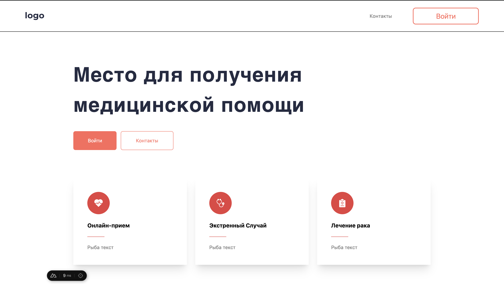
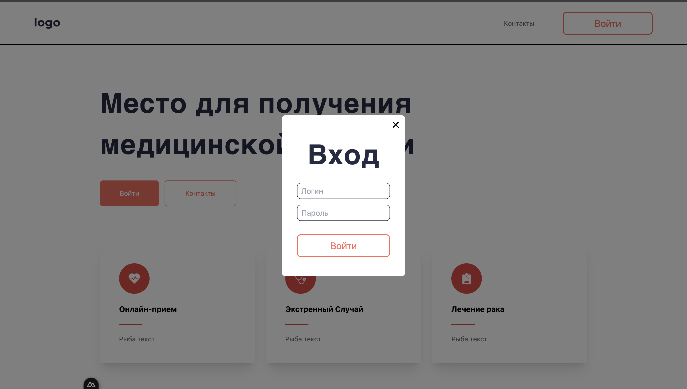
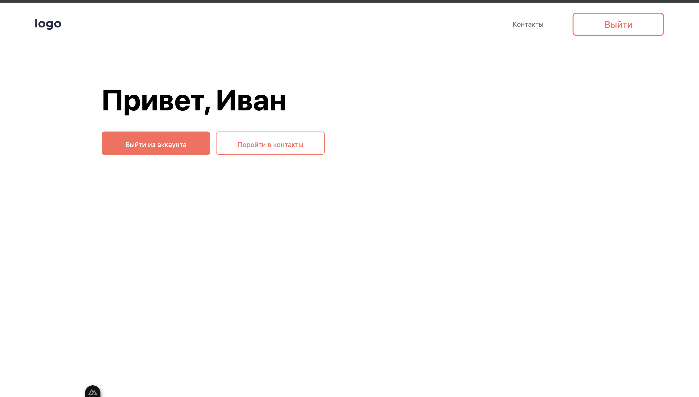
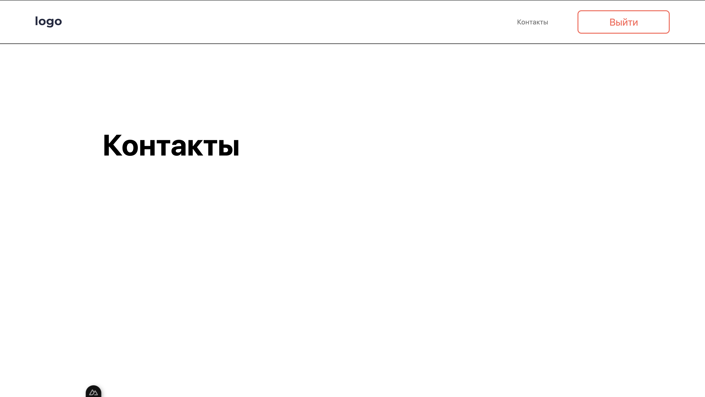

# Тестовое задание: Авторизация на Vue/Nuxt

## Описание проекта

Это тестовое приложение реализовано на **Nuxt 3** с использованием **Composition API**.  
Цель: создать адаптивный сайт с авторизацией пользователей и личным кабинетом.

Функционал:  
- Главная страница с кнопкой входа (открывается модальное окно авторизации)  
- Личный кабинет доступен только авторизованным пользователям  
- Страница «Контакты» доступна всем пользователям  
- Авторизация хранит данные пользователя в `localStorage`  
- Проверка валидности пароля (минимум 8 символов)  
- Выход из аккаунта выполняет `logout` и редирект на главную  

---

## Структура проекта
 Тестовое_Aveds/
├─ app/
├─ assets/
├─ components/
│ ├─ base/
│   ├─ Btn.vue # Кнопки
│   └─ modal.vue # Модальное окно
│ ├─ layout/
│   └─ header.vue # шапка сайта
│ ├─ section/
│   └─ hero.vue # секция главной сттраницы
├─ composables/
│ └─ useAuth.js # composable для авторизации
├─ layouts/
│ └─ default.vue 
├─ middleware/
| └─ auth.js # Проверка авторизации для личного кабинета
├─ pages/
│ ├─ index.vue # Главная страница
│ ├─ account.vue # Личный кабинет
│ └─ contacts.vue # Страница контактов
├─ plugins/
├─ public/
│ └─ api/
│   └─ users.json # JSON с пользователями
├─ tsconfig.json
├─ tailwind.config.js
├─ nuxt.config.ts
├─ package.json
├─ package-lock.json
└─ README.md

## Скриншоты интерфейса

### 1. Главная страница

- Кнопка «Войти» открывает модальное окно авторизации
- Кнопка «Контакты» ведет на страницу контактов
- Адаптивная верстка для планшета и мобильных устройств

---

### 2. Модальное окно авторизации

- Поля для ввода логина и пароля
- Валидация: пароль минимум 8 символов
- После успешного входа редирект на личный кабинет

---

### 3. Личный кабинет

- Показывает имя пользователя
- Кнопка «Выйти» завершает сессию и возвращает на главную
- Личный кабинет доступен только авторизованным пользователям

---

### 4. Страница контактов

- Общедоступная страница

